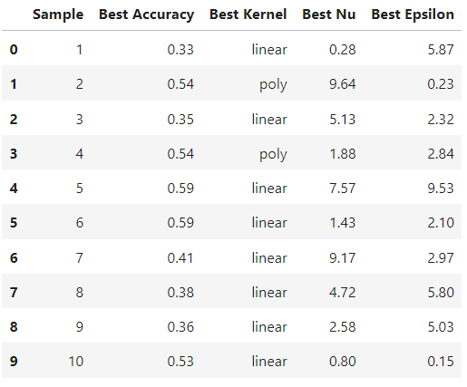
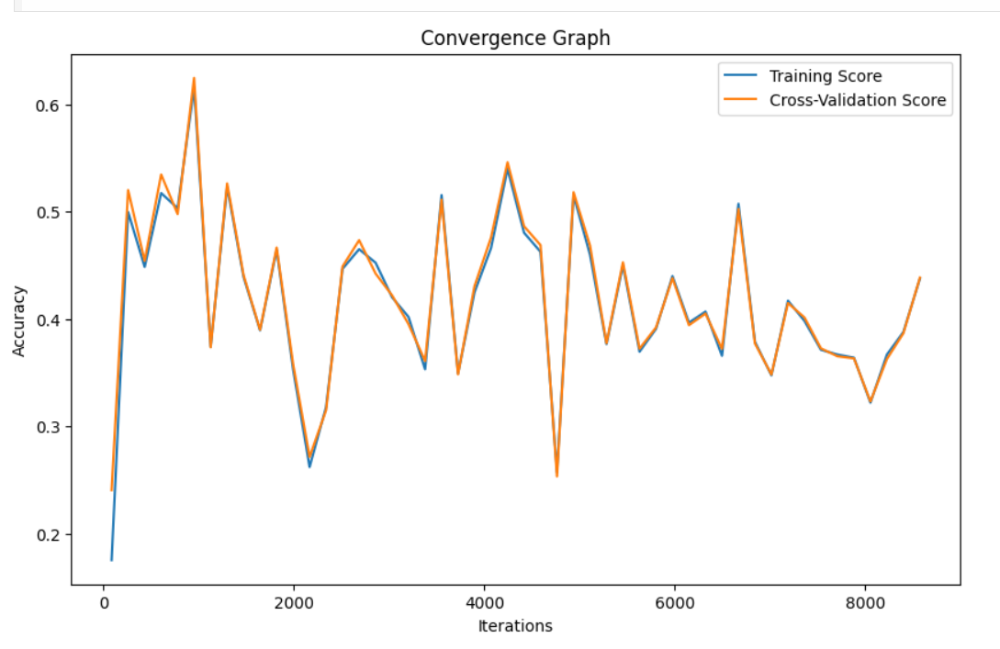

# Parameter Optimization

## Dataset Used
[Dry Bean](https://archive.ics.uci.edu/dataset/602/dry+bean+dataset)
Images of 13,611 grains of 7 different registered dry beans were taken with a high-resolution camera. A total of 16 features; 12 dimensions and 4 shape forms, were obtained from the grains.

## About Parameter Optimization
Parameter optimization, also known as hyperparameter tuning, is a crucial step in machine learning model development. It involves finding the best set of hyperparameters for a given machine learning algorithm to optimize its performance on a specific dataset.

## Comparative performance of Optimised-SVM with different samples
[

## Convergence Graph
[
